# Premium Theme Merchant App - Plan d'Implementation

Date: 2026-05-13  
Statut: Design valide (base approuvee)

## Objectif

Implementer le nouveau theme premium de l'application marchand SwimPay avec une execution fiable, sans incoherence visuelle entre ecrans, et avec des garde-fous anti-regression design.

## References mockup (14 ecrans)

Les mockups ci-dessous sont sauvegardes dans le repo et servent de reference visuelle officielle pour l'implementation.

Chemin source:
`design/mockups/premium-theme-2026-05-13/`

### Ecran 01 - Account Entry
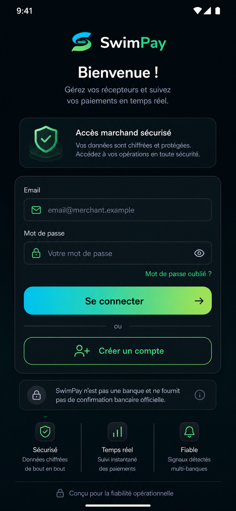

### Ecran 02 - Onboarding Notifications
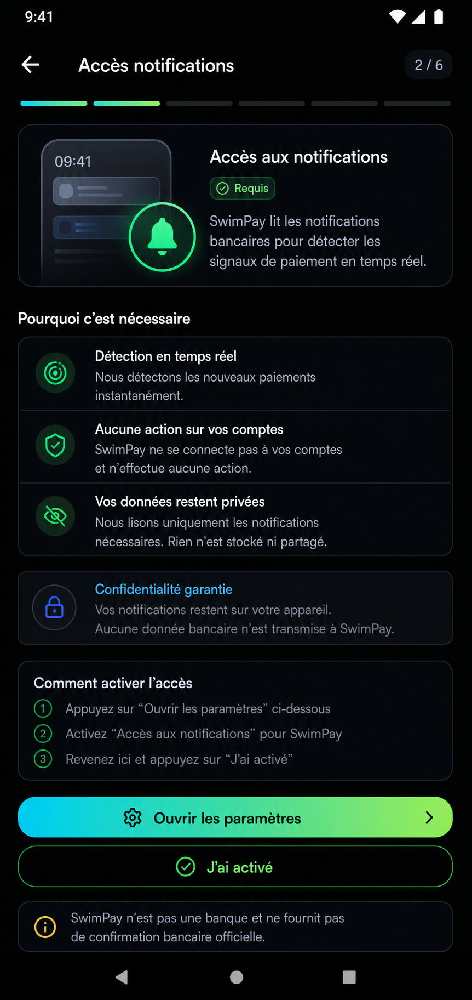

### Ecran 03 - Selection Banques Supportees
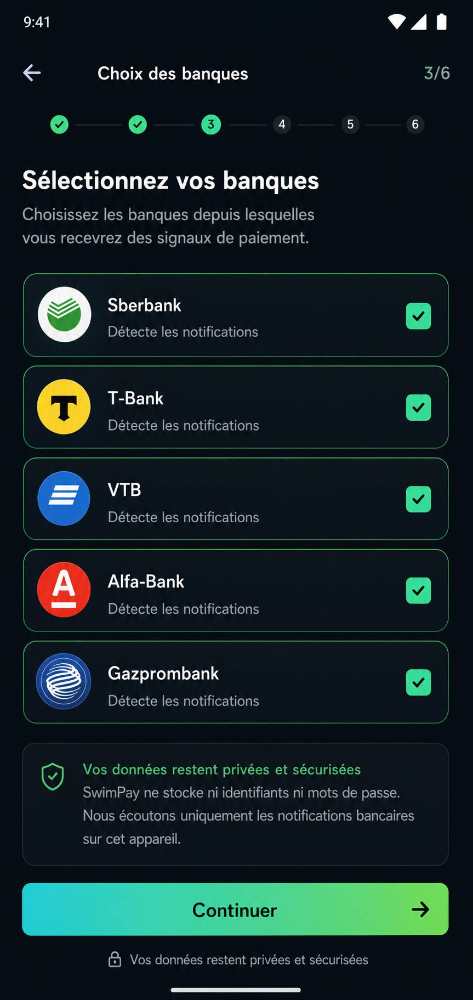

### Ecran 04 - Configuration Methode de Reception
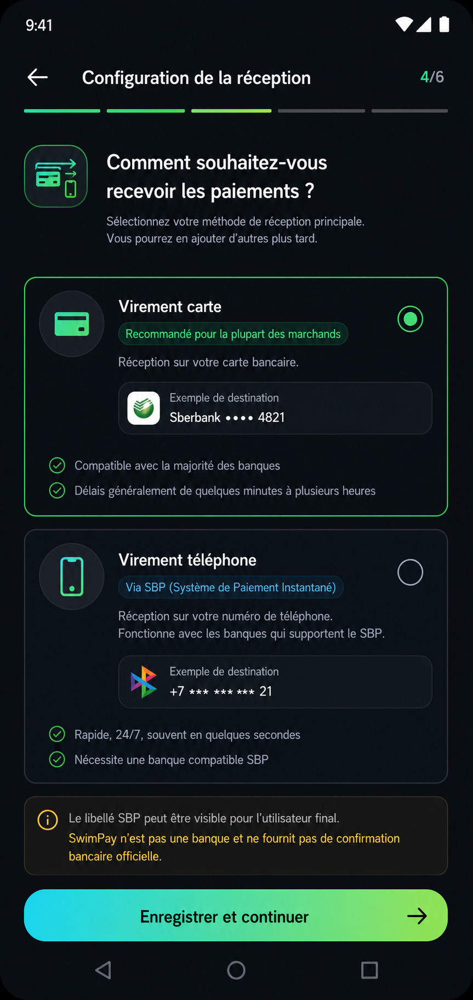

### Ecran 05 - Site ou Application
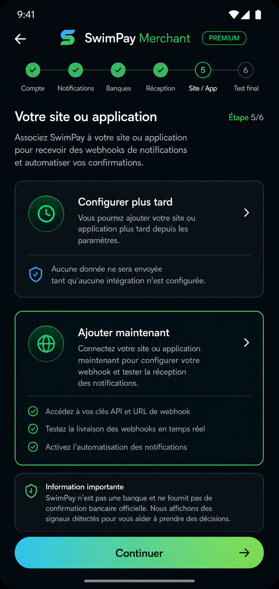

### Ecran 06 - Test Webhook Onboarding
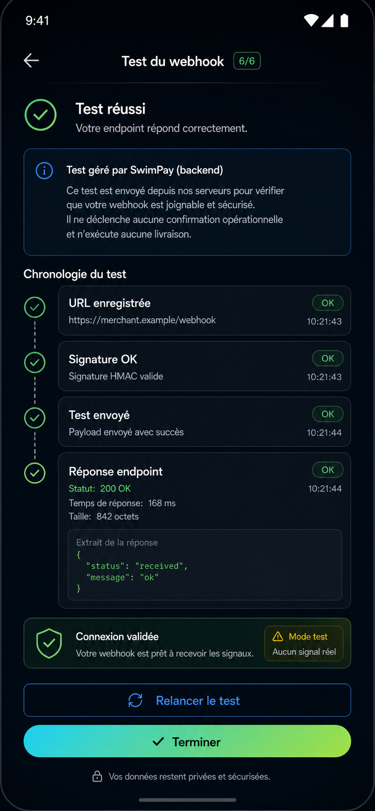

### Ecran 07 - Dashboard Marchand
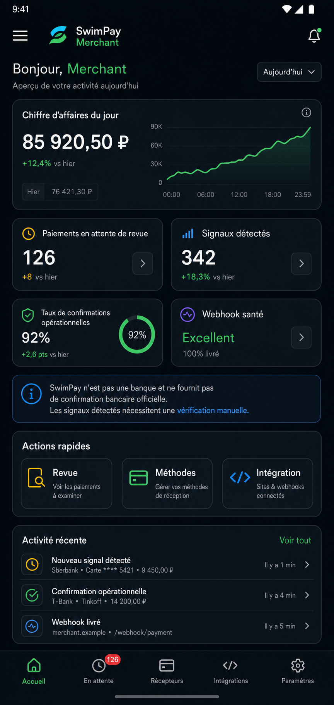

### Ecran 08 - Review Queue
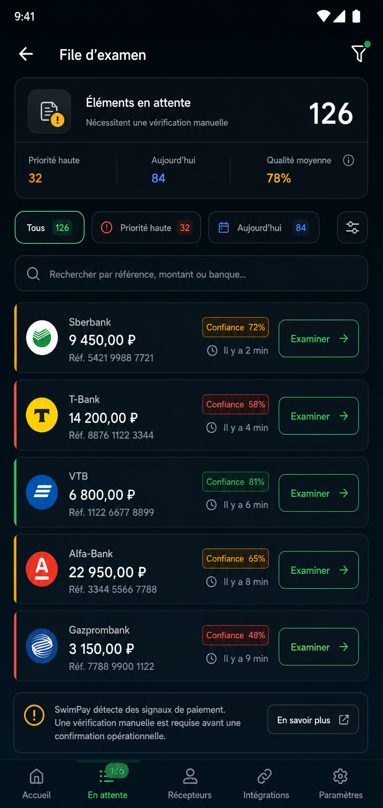

### Ecran 09 - Detail Review
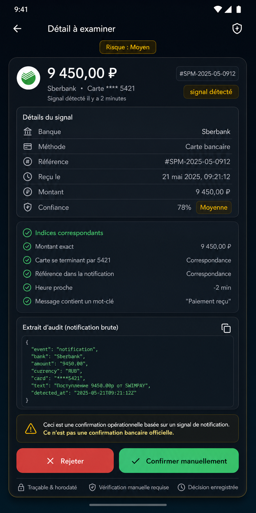

### Ecran 10 - Receiving Methods
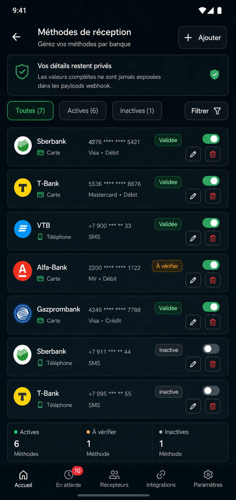

### Ecran 11 - Connected Site / Integration Overview
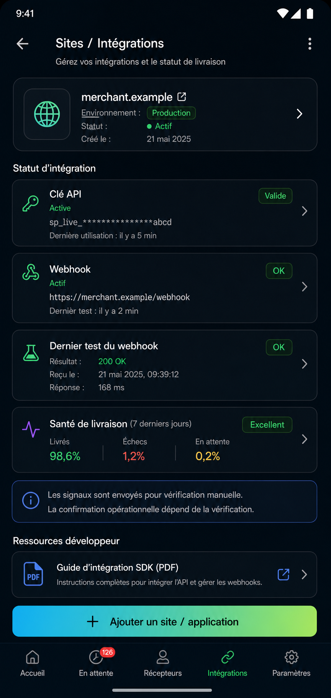

### Ecran 12 - Developer Integration Details
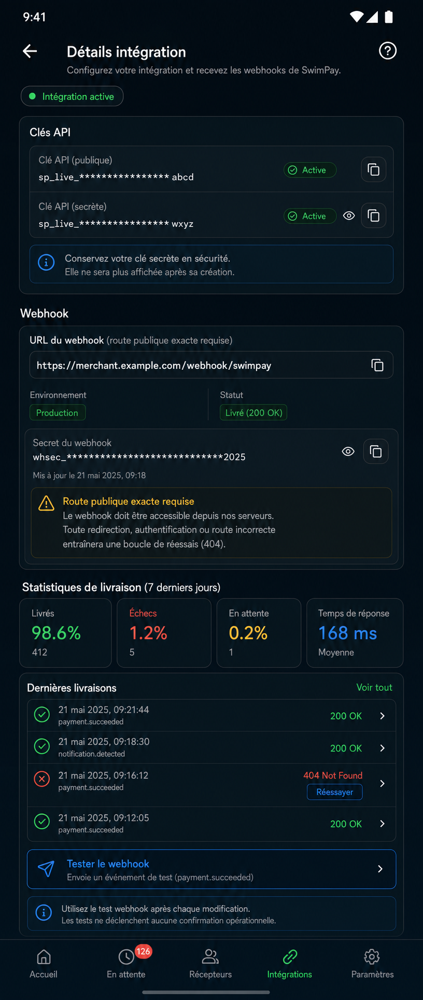

### Ecran 13 - Receiver Health & Runtime
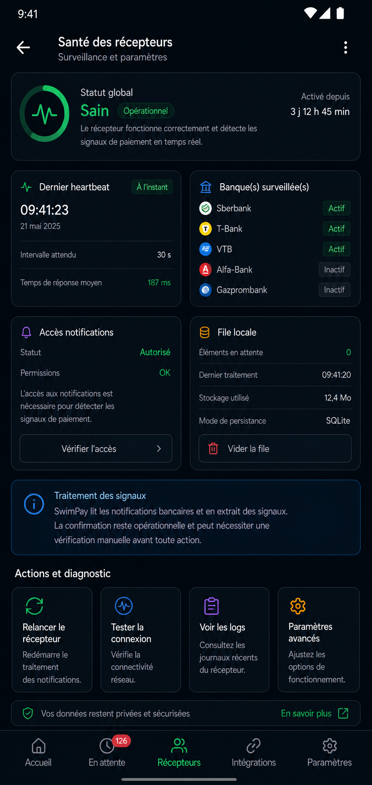

### Ecran 14 - Security & Settings
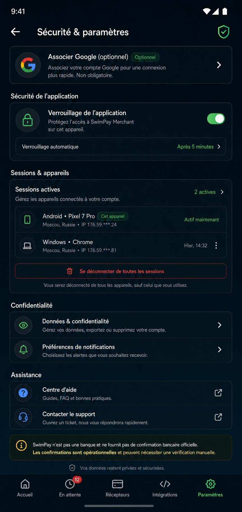

## Plan d'implementation

1. **Freeze du contrat UI (J0)**
   - Geler ces 14 ecrans comme reference.
   - Lister les tokens visuels obligatoires: couleurs, typo, spacing, radius, shadows, chips, boutons.
   - Verrouiller le vocabulaire produit (pas de claim de confirmation bancaire officielle).

2. **Fondation design system premium (J1)**
   - Creer/normaliser les composants communs (bento cards, chips, inputs, CTA, status panels).
   - Unifier la grille mobile et la densite d'information.
   - Stabiliser les etats globaux: loading, empty, error, offline.

3. **Navigation + shell applicatif (J1-J2)**
   - Harmoniser app bar, bottom nav, blocs d'actions, transitions.
   - Verifier la continuite visuelle d'un ecran a l'autre.

4. **Implementation fonctionnelle par lots (J2-J4)**
   - Lot A: Ecrans 01-06 (auth + onboarding + test webhook).
   - Lot B: Ecrans 07-10 (dashboard + revue + methods).
   - Lot C: Ecrans 11-12 (integration developpeur).
   - Lot D: Ecrans 13-14 (health + securite).

5. **Alignement backend/API en parallele**
   - Garder les URL, snippets et labels generiques (`merchant.example`).
   - Conserver les regles produit: `notification_signal`, `official_bank_confirmation=false`.
   - Valider la logique test webhook backend-owned.

6. **Qualite, tests, validation (J4-J5)**
   - Tests UI/snapshot sur les 14 ecrans.
   - Tests copy guardrails (vocabulaire interdit).
   - Smoke test staging: onboarding -> integration -> test webhook -> revue manuelle.

## Garde-fous anti-incoherence et anti-regression design

### 1) Guardrails visuels obligatoires

- Un seul systeme d'icones sur tout le parcours (pas de mix de styles).
- Un seul set de tokens couleur/typographie (pas de couleur locale d'ecran).
- Meme grille d'espacement pour tous les ecrans (marges, gutters, hauteur de cards).
- Radius/shadows uniformes par type de composant.
- Etats de composants standardises: default/hover/pressed/disabled/error/success.

### 2) Guardrails de contenu/copy

- Interdiction de termes suggerant confirmation bancaire officielle.
- Utiliser uniquement les termes compatibles produit (`signal`, `verification manuelle`, `confirmation operationnelle`).
- Exemples integration toujours generiques (jamais lies a une app tierce unique).

### 3) Guardrails de continuite UX

- Meme pattern de CTA primaire/secondaire sur tous les ecrans.
- Meme emplacement des statuts critiques (warnings, erreurs, succes).
- Pas de changement brutal de hierarchie visuelle entre ecrans consecutifs.

### 4) Guardrails de regression (pipeline)

- Baseline screenshot obligatoire des 14 ecrans.
- Echec QA si ecart visuel majeur non approuve (layout/spacing/iconography/copy).
- Checklist manuelle obligatoire avant release:
  - coherence icon set;
  - coherence tokens;
  - lisibilite mobile;
  - respect terminologie produit.

### 5) Gate de validation finale

Un ecran n'est pas "done" si:
- il diverge du mockup de reference sans decision explicite;
- il introduit une incoherence d'icone/couleur/grille;
- il viole la terminologie produit;
- il casse la continuite d'un flux complet onboarding -> operation.

