# SwimPay Tontine — l'architecture du système de protection

> Étape 1 sur 4 du chantier tontine, décidée par LO le 29 septembre 2026 :
>
> 1. **le cœur : le système robuste de protection contre les arnaques** (ce document) ;
> 2. la facturation du service ;
> 3. la protection contre la cybercriminalité, surface par surface ;
> 4. la défense de cybersécurité contre les problèmes classiques.
>
> Il réunit `24_TONTINE_EVENEMENT.md` (les arnaques et les modules),
> `25_TONTINE_CATALOGUE.md` (les formats éprouvés), les apports retenus du dossier
> DeepSeek et les corrections de sa revue (`26_REVUE_DOSSIER_TONTINE.md`). Il les
> organise en **un système, six sous-systèmes, vingt-trois modules**, avec des
> invariants, des interfaces et un comportement défini quand quelque chose tombe en
> panne, y compris SwimPay.
>
> `[H]` = proposition à valider. Rien n'est codé.

---

## 1. La vue d'ensemble

```mermaid
flowchart LR
  subgraph S1["S1 · ADMISSION — qui entre"]
    M1[M1 Identité unique]
    M2[M2 Graphe des liens]
    M3[M3 Éligibilité et preuve des fonds]
    M4[M4 Réputation]
  end
  subgraph S2["S2 · CONTRAT — les règles"]
    M5[M5 Catalogue éprouvé]
    M6[M6 Pacte]
    M7[M7 Cycle de vie]
  end
  subgraph S3["S3 · TIRAGE — l'ordre"]
    M8[M8 Tirage prouvé]
  end
  subgraph S4["S4 · ARGENT — le coffre"]
    M9[M9 Grand livre]
    M10[M10 Coffre et verrous]
    M11[M11 Échéancier]
    M12[M12 Prise protégée]
    M13[M13 Clôture]
  end
  subgraph S5["S5 · RISQUE — l'arbitrage"]
    M14[M14 Filet]
    M15[M15 Défaut et recouvrement]
    M16[M16 Remplacement]
    M17[M17 Événements de vie]
    M18[M18 Litiges]
  end
  subgraph S6["S6 · SURVEILLANCE — la confiance"]
    M19[M19 Carnet]
    M20[M20 Détection de fraude]
    M21[M21 Conformité]
    M22[M22 Vie privée]
    M23[M23 Réconciliation et santé]
  end
  S1 --> S2 --> S3 --> S4
  S4 <--> S5
  S6 -.observe.-> S1 & S2 & S3 & S4 & S5
```

Le chemin d'un événement suit l'ordre des sous-systèmes : on **admet** les membres,
on **fige** les règles, on **tire** l'ordre, puis l'**argent** circule sous
l'**arbitrage** du risque. La **surveillance** observe tout, à chaque étape.

---

## 2. Les invariants : ce que le système ne viole jamais

Un invariant n'est pas une intention : c'est une propriété **vérifiée par le code**,
dont la violation arrête l'événement et alerte. C'est ce qui distingue un système de
grade entreprise d'une application.

| # | Invariant | Vérifié par |
|---|---|---|
| **I1** | **Conservation de l'argent** : à tout instant, cotisations reçues = prises versées + retenues + fonds de garantie + frais + montants en attente. Au franc près | M9, M23 |
| **I2** | **Personne ne déplace un franc bloqué hors des règles**, ni un membre, ni l'organisateur, ni SwimPay. Aucune exception à la main : chaque situation a sa règle écrite d'avance (`28` §5) | M10 |
| **I3** | **Après le tirage, rien ne change** : montant, rythme, membres, ordre. Le Pacte est scellé par une empreinte, vérifiée à chaque action | M6, M7 |
| **I4** | **Le gagnant d'un tour reçoit toujours sa prise complète**, dans les limites prouvées par le catalogue | M12, M14 |
| **I5** | **Un nouveau membre ne fait courir aucun risque au groupe**, par construction | M12, M5 |
| **I6** | **SwimPay ne gagne jamais sur les garanties** : ses revenus ne viennent que des frais. Le fonds non utilisé revient aux membres | M9, M13 |
| **I7** | **Chaque changement d'état a un motif** et laisse un événement dans le Carnet | M7, M19 |
| **I8** | **Tout est en entiers XOF**, comme le reste du Cerveau | M9 |
| **I9** | **Aucun format n'est ouvert sans avoir passé l'épreuve** du simulateur | M5 |
| **I10** | **Une panne de SwimPay ne pénalise jamais un membre** : un retard causé par le système n'est pas un retard du membre | M7, M11, M23 |

---

## 3. Les six sous-systèmes

### S1 · Admission — *qui entre*

Il décide qui peut participer. Tout ce qui s'y joue se passe **avant le tirage** :
c'est là qu'une arnaque est la moins chère à arrêter.

| Module | Rôle | Ce qu'il arrête |
|---|---|---|
| **M1 Identité unique** | Une pièce d'identité = une personne = une place par événement. Numéro principal vérifié | Faux comptes, comptes multiples |
| **M2 Graphe des liens** | Repère les comptes liés : même appareil, mêmes sources de recharge, comptes créés ensemble, argent qui circule en boucle entre eux. **Il ne bloque rien** : les comptes liés sont traités comme **un seul emprunteur**, leurs découverts additionnés sous une seule limite, et leurs retenues montent d'elles-mêmes (`28` §4) | La bande, l'organisateur qui remplit avec ses comptes |
| **M3 Éligibilité et preuve des fonds** | Test automatique : pièce, **caution et première cotisation bloquées immédiatement**, capacité à tenir sur les entrées réelles, limites d'engagement | L'arnaqueur sans argent |
| **M4 Réputation** | Trois niveaux : **nouveau, confirmé, très fiable**, gagnés en terminant des événements. Le score global suit le membre d'un événement à l'autre ; il est exportable plus tard | Le défaillant qui recommence ailleurs |

**Les deux modes** (apport DeepSeek, corrigé par la revue) sont **un réglage de
recrutement, et rien d'autre** :

- **Global** : on rejoint des inconnus, par découverte de places libres ;
- **Fermé** : on invite ses proches.

**Dans les deux modes, le tirage est le même, et la garantie dépend du niveau de
chaque membre, jamais du mode.** La plupart des arnaques de tontine réelles se font
entre gens qui se connaissent.

### S2 · Contrat — *les règles*

| Module | Rôle |
|---|---|
| **M5 Catalogue éprouvé** | Les seuls formats proposés : Éclair, Relais, Marathon ; Cercle, Clan, Tribu. Règles N = B × T, B ∈ {1, 2, 3}, N ≤ 30. **Un format n'est ouvert qu'après avoir passé le pire scénario du simulateur** (`25`) |
| **M6 Pacte** | L'accord signé avec le code secret : montant, rythme, tours, objectif, caution, retenue, frais, sanctions, clauses de vie. **Scellé au tirage par une empreinte** |
| **M7 Cycle de vie** | La machine à états : Brouillon → Recrutement → Éligibilité → Tirage → Figé → Tours → Clôture ; Annulé (avant le tirage seulement) ; **Suspendu** (panne de SwimPay, voir §5) ; Incident |

### S3 · Tirage — *l'ordre*

| Module | Rôle |
|---|---|
| **M8 Tirage prouvé** | Devant les membres connectés : SwimPay publie d'abord une **empreinte** de son propre nombre au hasard ; chaque membre connecté ajoute son **geste** ; le résultat combine tout, s'affiche en direct, **définitif**. Chacun peut refaire le calcul et vérifier. Trouvé par nous et par DeepSeek, indépendamment |

**Règle sans exception** : le pur hasard. Pas de tirage négocié, dans aucun mode.

### S4 · Argent — *le coffre*

| Module | Rôle |
|---|---|
| **M9 Grand livre** | Chaque mouvement de la tontine en **double écriture**, dans le socle déjà spécifié (`01_LEDGER_SOCLE_SPEC.md`). Chaque événement a ses comptes : pot, retenues, fonds de garantie, frais |
| **M10 Coffre et verrous** | **Deux zones seulement** (décision de la revue) : *libre* et *bloquée*. L'argent bloqué ne sort que vers la tontine, selon ses règles. *La zone « enfermée » du dossier DeepSeek est écartée : elle fuit vers un complice* |
| **M11 Échéancier** | Bloque chaque cotisation à l'échéance, entière, automatiquement. Délais de grâce selon le rythme |
| **M12 Prise protégée** | Le **moteur de retenue** : le gagnant reçoit sa prise moins la retenue qui paie ses cotisations restantes. La retenue est **calculée** pour que le découvert ne dépasse jamais ce que le Filet peut couvrir, selon le niveau et le format |
| **M13 Clôture** | Rend les cautions et le fonds non utilisé, met à jour la Réputation, émet les attestations |

Chaque versement d'argent vers l'extérieur est **à exécution unique** : une prise ne
peut pas partir deux fois, même si une requête est rejouée. C'est la même règle que
pour la certification FNE dans le Cerveau (`invoicer/dgi-adapter.ts`, verrou
single-flight).

### S5 · Risque — *l'arbitrage*

| Module | Rôle |
|---|---|
| **M14 Filet** | Dans l'ordre : retenue du défaillant, sa caution, le fonds de garantie de l'événement, puis **SwimPay en dernier recours**, dans un plafond fixé |
| **M15 Défaut et recouvrement** | L'échelle graduée (apport DeepSeek, resserrée) : rappel → délai de grâce → pénalité → saisie par le Filet → exclusion → recouvrement civil. **La PLCC seulement en cas de fraude** : fausse identité, comptes multiples, collusion organisée |
| **M16 Remplacement** | La règle que le dossier DeepSeek n'avait pas : **un remplaçant paie d'abord les cotisations déjà échues, ou prend la dernière place**. Remplacement possible seulement si le partant **n'a pas encore reçu** ; s'il a reçu, sa dette est née et relève de M15 |
| **M17 Événements de vie** | **La tontine n'a pas besoin de connaître la cause d'un défaut.** Un décès ou une incapacité suit la même échelle qu'un impayé (M15, M16). Ce qui revient au membre est versé sur son compte SwimPay, et la succession se règle au niveau du compte, selon la loi, hors de la tontine (`28` §5, ligne 8). *La procédure du dossier DeepSeek (certificat vérifié en 7 jours) demandait un humain : écartée* |
| **M18 Litiges** | **Aucun arbitre.** Chaque litige possible a sa règle et sa preuve : le Carnet, le tirage vérifiable, le Pacte signé avec les chiffres du membre. Une erreur prouvée de SwimPay est compensée automatiquement par une réserve d'incidents (`28` §5, lignes 9 à 13) |

### S6 · Surveillance — *la confiance*

| Module | Rôle |
|---|---|
| **M19 Carnet** | Le journal de l'événement, horodaté, en ajout seul, visible par tous les membres. « J'ai payé » se vérifie en une seconde |
| **M20 Détection de fraude** | En continu, pendant l'événement : comptes qui se lient, retraits suspects juste après une prise, nouveaux comptes de retrait, schémas qui se répètent entre événements |
| **M21 Conformité** | Plafonds de monnaie électronique (2 000 000 F de solde, 10 000 000 F de recharges par mois, 200 000 F pour un porteur non identifié), prises versées sur la banque au-delà, alertes anti-blanchiment |
| **M22 Vie privée** | Pseudonymes, numéros masqués, états visibles mais jamais les soldes, signalement du harcèlement |
| **M23 Réconciliation et santé** | Chaque jour : la somme des enveloppes de toutes les tontines égale le solde réel chez le partenaire EME (I1). Et la santé du système : pannes de rails, retards imputables à SwimPay (I10) |

---

## 4. Les interfaces : comment les sous-systèmes se parlent

Aucun module n'écrit dans les données d'un autre. Ils échangent des **événements
nommés**, chacun avec un motif, que le Carnet enregistre tous :

| Événement | Émis par | Écouté par |
|---|---|---|
| `tontine.creee` | M7 | M5, M19 |
| `membre.admis` · `membre.refuse` | M3 | M7, M19, M2 |
| `groupe.lien_detecte` | M2 | M12 (additionne les découverts liés), M20 |
| `pacte.signe` · `pacte.scelle` | M6 | M7, M19 |
| `tirage.engage` · `tirage.revele` | M8 | M7, M19 |
| `cotisation.due` · `cotisation.bloquee` · `cotisation.manquee` | M11 | M9, M14, M15, M19 |
| `prise.versee` · `retenue.liberee` | M12 | M9, M20, M19 |
| `filet.sollicite` | M14 | M9, M15, M23, M19 |
| `defaut.escalade` | M15 | M4, M20, M19 |
| `tontine.suspendue` · `tontine.reprise` | M7 / M23 | M11, M19 |
| `tontine.close` | M13 | M4, M9, M19 |

Ce découpage permet de faire évoluer un module sans toucher aux autres, et de
**rejouer n'importe quel événement** à partir du Carnet pour comprendre un incident.

---

## 5. Quand quelque chose tombe en panne

Un système de grade entreprise se juge à ce qu'il fait quand ça casse.

| Panne | Ce que fait le système |
|---|---|
| **Le partenaire EME ou un rail ne répond pas à l'échéance** | L'événement passe en **Suspendu** : l'horloge s'arrête, aucun membre n'est compté en retard (I10), tout reprend à la même place. Les membres sont prévenus |
| **Un versement de prise échoue en cours de route** | Il n'est **jamais relancé à l'aveugle** : on vérifie d'abord ce qui est réellement parti (la leçon du Cerveau pour la FNE), puis on complète |
| **La réconciliation quotidienne trouve un écart** (I1) | L'écart est une faute de SwimPay : la réserve d'incidents le comble aussitôt et la tontine continue. Au-delà de la réserve, l'événement passe en **Suspendu**. L'enquête se fait à côté, sans bloquer les membres (`28` §5, ligne 21) |
| **SwimPay fait faillite** (Q6 du dossier DeepSeek) | Les fonds sont chez le partenaire EME, sur un compte dédié, **hors du bilan de SwimPay** (`03_RESEARCH_COMPLETE.md` §1.4). Le Grand livre permet de rendre à chacun sa part. **À vérifier dans le contrat EME** |
| **Un tirage est interrompu** (réseau, application fermée) | Le tirage n'est révélé que lorsqu'il est complet ; s'il est interrompu, il reprend avec la même empreinte, sans possibilité de retirer le résultat |

---

## 6. Ce qu'on construit d'abord, et ce qui attend

| En V1 | Plus tard |
|---|---|
| S1 complet (dont M2 dans une première version simple) | Score exportable hors de SwimPay |
| S2 et S3 complets | Caisse de solidarité optionnelle (apport DeepSeek) |
| S4 complet | Garant tiers (écarté en V1 : consentement, solvabilité et collusion à traiter d'abord) |
| S5 : M14, M15, M16, M17, M18 | Zone de paiement restreinte à des usages non convertibles (factures, écoles) |
| S6 : M19, M21, M22, M23, et M20 à base de règles | M20 appuyé sur l'apprentissage, quand il y aura des données |
| Mono-pays : Côte d'Ivoire (décision de LO, Q7) | UEMOA, puis diaspora |

---

## 7. Ce que LO et moi devons encore trancher sur le cœur

- [ ] **Le plafond du dernier recours SwimPay** (M14) : 2 % de la collecte, comme
      éprouvé dans `25` ?
- [ ] **Le délai de suspension maximal** (§5) avant d'annuler et de tout rendre.

Le seuil de collusion et les « deux personnes » d'arbitrage ont disparu : LO a
posé le 29/09 que le système fonctionne **sans aucune intervention humaine**.
Les autres décisions du cœur sont dans `28_TONTINE_CONTROLE.md` §7.

Étape suivante : **la facturation du service de tontine.**
